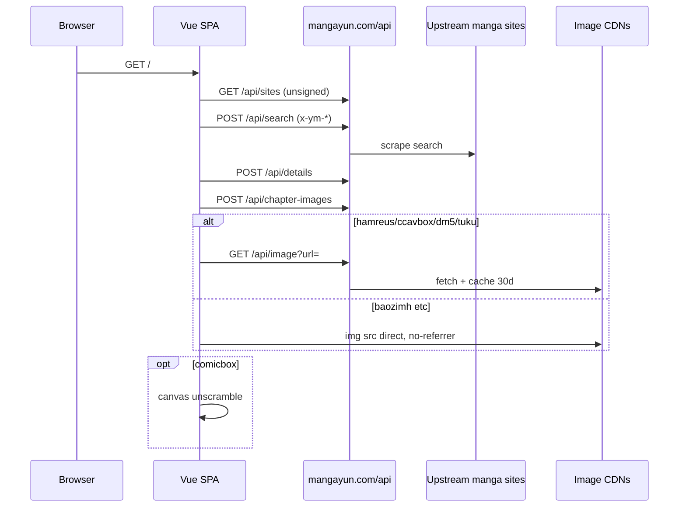

# 云漫 MangaYun（mangayun.com）前端 / API 逆向报告

> 分析日期：2026-09-20
> 目标：https://mangayun.com/
> 签名字段：`x-ym-ts` / `x-ym-nonce` / `x-ym-sign`
> 工具链：curl、静态 JS 阅读、Python 复现（无 js-reverse MCP / 无浏览器 Hook）
> Case：[`work/20260920-mangayun/scope.md`](../work/20260920-mangayun/scope.md)

## 0. Evidence chain

### 0.1 Scope 摘要

| 项 | 值 |
|---|---|
| auth.status | granted（用户明确要求逆向该站） |
| in_scope | `mangayun.com` 前端与同源 `/api/` |
| network_profile | authorized_target_only |
| 不做 | 爆破后台、撞库、DoS、大规模拉图、打第三方漫画源站 |

### 0.2 Evidence

| ID | 摘要 | source_ref | hash |
|---|---|---|---|
| E-001 | Vue 3 + Vite SPA，Cloudflare | GET / | n/a |
| E-002 | robots 泄漏 `/api` `/read` `/s` `/manage-cloudream-8f92a` | GET /robots.txt | n/a |
| E-003 | SHA-256 签名 + 硬编码 salt | index-bbC94IHS.js | `2f7654cf…e8a0` |
| E-004 | POST 强制签名；时间窗 ~90–120s；nonce 可重放 | /api/search | n/a |
| E-005 | 12 源聚合 search/details/images | /api/* | n/a |
| E-006 | 图代理白名单，file/127.0.0.1 被拒 | /api/image | n/a |
| E-007 | comicbox MD5 竖切还原 | comicbox-engine-CNYk4vYL.js | `4eaf6888…3cd3` |
| E-008 | 后台路径 + 密码登录（空密码 401） | /manage-cloudream-8f92a | n/a |
| E-009 | LINUX DO OAuth；cookie `ym_token` | /api/auth/linuxdo | n/a |

### 0.3 Findings

| ID | 标题 | severity | status | evidence | confidence |
|---|---|---|---|---|---|
| F-001 | 前端 salt 可复现 API 签名 | medium | validated | E-003 E-004 | high |
| F-002 | 后台路径写进 robots/JS | low | validated | E-002 E-008 | high |
| F-003 | 图代理有 host/scheme 白名单 | info | validated | E-006 | high |
| F-004 | comicbox 切片算法已还原 | n/a_re | validated | E-007 | high |

### 0.4 Path

`P-001` callflow：`/api/sites` → 签名 `POST /api/search` → `POST /api/details` → `POST /api/chapter-images` → 可选 `/api/image` 或 comicbox canvas。详见 `work/20260920-mangayun/report/findings.md`。

### 0.5 Timeline

见 [`work/20260920-mangayun/timeline.md`](../work/20260920-mangayun/timeline.md)。

---

## 1. 目标请求

前端 `L(path, init)` 对 JSON API 一律带：

```http
POST /api/search HTTP/1.1
Host: mangayun.com
Content-Type: application/json
x-ym-ts: 1789837636822
x-ym-nonce: <16 chars base36>
x-ym-sign: <sha256 hex>

{"keyword":"一拳超人"}
```

签名原文（**不是 HMAC**）：

```text
SHA256( path + "|" + rawBody + "|" + ts + "|" + nonce + "|" + "ym-salt-883a0f7e-29f1-4b72-9ad2" )
```

`rawBody` 是 `fetch` 的字符串 body。`JSON.stringify` 紧凑格式和带缩进的 JSON 都能过，只要 sign 对着**实际发出去的字节**算。

## 2. 定位过程

js-reverse MCP 本机不可用，走 fallback：下载 Vite 产物做静态阅读。

主包 `index-bbC94IHS.js`（47049 B）里直接出现 salt、全部 `/api/*` 路径、路由编码和管理后台入口。没有 sourcemap（`.map` 回到 SPA HTML）。

## 3. 算法还原

### 3.1 API 签名

| 项 | 值 |
|---|---|
| 算法 | SHA-256 hex |
| 拼接 | `path\|body\|ts\|nonce\|salt` |
| salt | `ym-salt-883a0f7e-29f1-4b72-9ad2`（bundle 常量 `tn`） |
| ts | `Date.now()` 毫秒字符串 |
| nonce | `Math.random().toString(36).substring(2,10)` × 2 |
| 时间窗 | −90s 通过，−120s 403；+60s 通过 |
| 重放 | 同一 `(ts,nonce,sign)` 立刻再 POST 仍 200 |
| GET 目录 | `/api/sites`、`/api/home-sections` 目前**不校验**签名 |
| POST | `/api/search` `/api/details` `/api/chapter-images` **强制**签名 |

浏览器跨域预检：

```http
Access-Control-Allow-Origin: *
Access-Control-Allow-Headers: content-type
Access-Control-Allow-Methods: GET,POST,OPTIONS
```

自定义 `x-ym-*` 不在 allow-headers 里，所以**别的网站的前端**发不了签名 POST；curl/Python 不受 CORS 限制。

### 3.2 Comicbox 解扰

`comicbox-engine-CNYk4vYL.js`：

1. URL 含 `ccavbox.com` / `/break_2/` / `comicbox.xyz`
2. 解析 `/book/{bookId}/{chapter}/{page}.`
3. `N = [44,48,52,56,60,64,68,72,76,80][md5(bookId+pageNumber)[-1].charCodeAt(0) % 10]`
4. 把图按高度切成 N 条横带（余数贴第 0 条），源从底向上、目标从上向下 `drawImage`
5. `canvas.toDataURL("image/jpeg", 0.9)`

封面 `/cover` `/cover_pc` 不拼。

### 3.3 图代理

前端把这些 host / siteId 改写成 `/api/image?url=&siteId=`：

- host：`hamreus.com` `cdndm5.com` `ccavbox.com` `bgm.tv` `tuku.cc`
- siteId：`manhuagui` `comicbox` `manben` `dm5` `tuku`

`` 失败时再 fallback 一次代理。服务端拒 `file:` 和非白名单 host。

## 4. 站点结构



| 路由 | 含义 |
|---|---|
| `/` | 首页 Atlas + 搜索 |
| `/s/{keyword}` | 搜索 |
| `/m/{id}` | 漫画详情；id = base64url(JSON `[siteId, detailUrl]`) |
| `/read/{id}/{ch}` | 阅读器；ch = base64url(chapterUrl) |
| `/manage-cloudream-8f92a` | 运营后台 |

`/api/sites` 当前 12 源：

| siteId | 名称 |
|---|---|
| baozimh | 包子漫画 |
| mangacopy | 拷贝漫画 |
| dm5 | 动漫屋 |
| mangabz | 漫画巴士 |
| manben | 漫本 |
| manhuagui | 漫画柜 |
| comicbox | 歪歪漫画 |
| manhuazhijia | 漫画之家 |
| tuku | 图库漫画 |
| rumanhua | 如漫画 |
| hipmh | 云漫极速（结果列表加权最高） |
| komiic | Komiic |

客户端搜索时丢掉 `manhuazhan`、`kanman`。

用户登录：`GET /api/auth/linuxdo` → LINUX DO OAuth（`client_id=8gnCAmmnyLRHkTRHistkIYNtaf0CUQKI`）→ 回跳 `?auth_token=` 写入 `localStorage.ym_auth_token`，同时 cookie `ym_token`。书架 `/api/user/shelf` 要登录。

后台：密码换 `x-admin-token`，可改首页展区、黑名单、导出用户/书架 CSV。空密码返回 `密码错误`。未做爆破。

## 5. 本地复现

```bash
uv run python client/mangayun_client.py sites
uv run python client/mangayun_client.py search 一拳超人
uv run python client/mangayun_client.py details baozimh 'https://www.baozimh.com/comic/yiquanchaoren-one'
```

核心函数：

```python
import hashlib, time, secrets

SALT = "ym-salt-883a0f7e-29f1-4b72-9ad2"

def sign_headers(path: str, body: str = "") -> dict[str, str]:
    ts = str(int(time.time() * 1000))
    nonce = secrets.token_hex(8)  # 16 hex; 前端是 16 位 base36，服务端当不透明字符串
    raw = f"{path}|{body}|{ts}|{nonce}|{SALT}"
    return {
        "x-ym-ts": ts,
        "x-ym-nonce": nonce,
        "x-ym-sign": hashlib.sha256(raw.encode()).hexdigest(),
    }
```

已验证：带上述头的 `POST /api/search` 返回 12 个源的结果；不带头返回 403「签名校验未通过」。

## 6. 验证结果

| 检查 | 结果 |
|---|---|
| 复现签名搜「一拳超人」 | 200，约 46 KB |
| 包子详情 | 435 章 |
| 包子某一话图片 | 29 张 `s2.bzcdn.net` JPEG |
| comicbox 详情 | ccavbox `/break_2/` 封面与分页 |
| 漫画柜图片 | `us.hamreus.com` 带 `e`/`m` 热链参数 |
| 空签名 POST | 403 |
| 错 salt / 错 path | 403 |
| ts 过期 120s | 403 |
| 图代理 SSRF 探针 | 400 协议/域名不支持 |

## 7. 风控与残留

- 签名密钥在 JS 里，只能当「弱反爬」：挡过期请求和浏览器跨域，挡不住脚本。
- nonce 未见一次性消耗。
- CORS `*` + 仅允许 `content-type`：对浏览器有用，对 CLI 无效。
- 图代理有 allowlist，未看到开放 SSRF。
- 后台靠密码，路径已公开。
- OAuth `auth_token` 出现在 query，会进 Referer / 历史。
- 未分析服务端实现（像 Cloudflare Worker / 反代聚合），也未跟 LINUX DO 回调细节。

## 8. 附件

- 客户端：`client/mangayun_client.py`
- 产物：`work/20260920-mangayun/evidence/bundles/`
- robots：`work/20260920-mangayun/evidence/samples/robots.txt`
